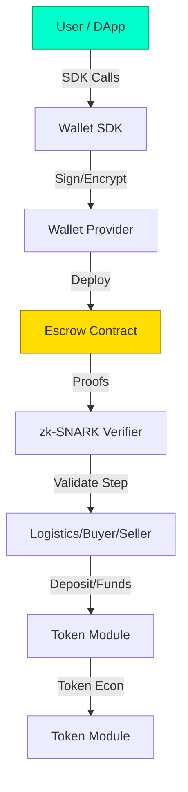

# Midnight Pangolin Project

A privacy‑first, three‑party escrow protocol built on the Midnight Network.  
It enables Sellers, Buyers, and Logistics partners to conduct trust‑minimized transactions using zk‑SNARKs in the Compact language, with a TypeScript SDK and CLI for easy integration.

---  

## Table of Contents
1. [Project Overview](#project-overview)  
2. [Vision & Goals](#vision--goals)  
3. [Architecture & Key Components](#architecture--key-components)  
4. [Project Structure](#project-structure)  
5. [Technology Stack](#technology-stack)  
6. [Project Structure Diagram](#project-structure-diagram)  
7. [Participants & Use‑Cases](#participants--use-cases)  
8. [Getting Started](#getting-started)  
9. [Development Workflow](#development-workflow)  
10. [Testing & Verification](#testing--verification)  
11. [Deployment Checklist](#deployment-checklist)  
12. [Contributing](#contributing)  
13. [License](#license)  
13. [Contact & Support](#contact--support)  

---  

## 1. Project Overview
Midnight Pangolin is a decentralized escrow system that coordinates **Seller**, **Buyer**, and **Logistics** parties through a single on‑chain Compact contract. Funds are locked, privacy‑preserving proofs verify each step, and a timeout/dispute resolution mechanism redistributes assets automatically. The repository also provides a TypeScript SDK and CLI for front‑end and operational interactions.

---  

## 2. Vision & Goals
- **Privacy‑First Finance** – Shielded transactions and confidential asset management while staying regulator‑compliant.  
- **Interoperability** – Seamless bridges to other blockchains via zk‑proofs and standardized token interfaces.  
- **Security & Audibility** – Rigorous formal verification, static analysis, and community audits.  
- **Community Governance** – Transparent milestone tracking and inclusive contribution processes.

---  

## 3. Architecture & Key Components
| Component | Purpose | Path |
|-----------|---------|------|
| **Escrow Contract** | Core on‑chain logic for multi‑party escrow, proof verification, timeout & dispute handling | `contract/` |
| **Midnight Wallet Provider** | Creates, signs, and encrypts wallets; manages user keys | `src/wallet/provider/` |
| **Wallet SDK** | TypeScript façade exposing wallet functions to DApps | `middleware/ts-wallet-sdk/` |
| **Token Module** | Custom token economics, dust generation, UTXO handling | `src/token/` |
| **Protocol Framework** | ZK proofs, commitments, consensus primitives | `protocol/` |
| **CLI & Tooling** | Compact compiler, deployment scripts, verification utilities | `tools/` |

---  

## 4. Project Structure
```
/home/mose/projects/blockchain/Midnight-Pangolin
├─ contract/          # Solidity/Compact source & compiled artifacts
├─ api/               # TypeScript SDK (escrow3party-api)
├─ cli/               # Command‑line interface
├─ middleware/        # Wallet SDK implementation
├─ protocol/          # ZK proof and consensus primitives
├─ src/               # Shared source (config, utils, types)
├─ test/              # Vitest & Playwright test suites
├─ scripts/           # Deployment & deployment‑automation scripts
├─ docker/            # Devnet, indexer, proof‑server containers
├─ .github/           # CI/CD workflows
├─ .claude/           # Claude‑related configs
├─ .github/workflows/ # GitHub Actions definitions
├─ docker-compose.yml # Local devnet launch
└─ README.md
```

---  

## 5. Project Structure Diagram


---  

## 6. Participants & Use‑Cases
### Entities
- **Seller** – Lists goods, stakes collateral, defines terms.  
- **Buyer** – Funds purchase, provides payment secret, triggers delivery confirmation.  
- **Logistics Provider** – Verifies shipment, stakes collateral, receives payment.  
- **Off‑chain SDK / CLI** – Interacts with contracts, manages keys, displays UI.  

### Typical Flows
| Use‑Case | Description | Relevant Files |
|----------|------------|----------------|
| **Deposit** | Buyer deposits payment & security into escrow. | `contract/escrow3party.compact` |
| **Delivery Confirmation** | Logistics signs a zk‑SNARK proof proving goods were delivered. | `protocol/verifiers/` |
| **Timeout/Distribution** | If no proof is submitted before timeout, assets redistribute per governance rules. | `contract/escrow3party.compact` |
| **API Interaction** | DApp calls SDK methods to query state, invoke functions. | `api/escrow3party-api/` |

---  

## 7. Getting Started
```bash
# 1️⃣ Clone the repo
git clone https://github.com/M-kip/Midnight-Pangolin.git
cd Midnight-Pangolin

# 2️⃣ Install dependencies (pnpm)
pnpm install

# 3️⃣ Build the project
pnpm run build

# 4️⃣ (Optional) Spin up a local devnet
docker-compose up -d

# 5️⃣ Compile a sample contract
compact compile ./contracts/Counter.compact --language-version >=0.23
```

*For full step‑by‑step instructions see [docs/setup.md](docs/setup.md).*

---  

## 8. Development Workflow
1. **Branch Strategy**  
   - `main` – stable/production  
   - `feature/*` – new functionality  
   - `bugfix/*` – patches  
2. **Commit Conventions**  
   - `feat:` new feature  
   - `fix:` bug fix  
   - `docs:` documentation change  
   - `refactor:` code restructure  
3. **Pull‑Request Process**  
   - Open PR against `main`  
   - All CI checks must pass  
   - Obtain ≥2 approvals from core maintainers  
   - Merge only after final verification  

---  

## 9. Testing & Verification
- **Unit Tests** – `pnpm test` (Vitest) – cover logic layers.  
- **Integration Tests** – `pnpm test:e2e` (Playwright) – simulate end‑to‑end flows on devnet.  
- **Static Analysis** – `pnpm biome` – enforce code‑quality rules.  
- **Formal Verification** – use `/compact-core:verify` and `/midnight-verify` agents to compile, type‑check, and run witness‑based checks on contracts.  
- **Coverage Goal** – ≥85 % for critical modules.  

---  

## 10. Deployment Checklist
1. **Release Candidate Build** – `pnpm run build:release`  
2. **Package Contracts** – `compact pack ./contracts/ --output ./releases/`  
3. **Governance Proposal** – Submit metadata & audit reports.  
4. **Community Audit** – Run full verification suite, address findings.  
5. **Mainnet Deployment** – Execute official deployment script with governance‑approved parameters.  

---  

## 11. Contributing
- **Fork** the repository and create a feature branch.  
- Follow the **[Commit Message Guide](CONTRIBUTING.md#commit-guidelines)**.  
- Run `pnpm lint && pnpm type:check` before pushing.  
- Submit a **Pull Request** with a clear description and rationale.  
- All contributions are subject to the **[Code of Conduct](CODE_OF_CONDUCT.md)**.  

---  

## 12. License
This project is licensed under the **MIT License** – see the [LICENSE](LICENSE) file for details.

---  

## 13. Contact & Support
- **Discord:** `discord.gg/midnight-pangolin`  
- **Email:** `dev@midnight-pangolin.io`  
- **Documentation:** <https://docs.midnight-pangolin.io>  
- **Issue Tracker:** GitHub Issues  

---  

### Additional Diagrams & Use‑Case Notes
- The mermaid diagram above illustrates data flow between the SDK, Wallet Provider, Escrow Contract, and Verifiers.  
- Future extensions may include a **Governance Dashboard** (React + Vite) and **Proof‑Server** integration for real‑time verification status.  

*All diagrams are expressed in text/mermaid to keep them renderable in markdown‑compatible viewers.*